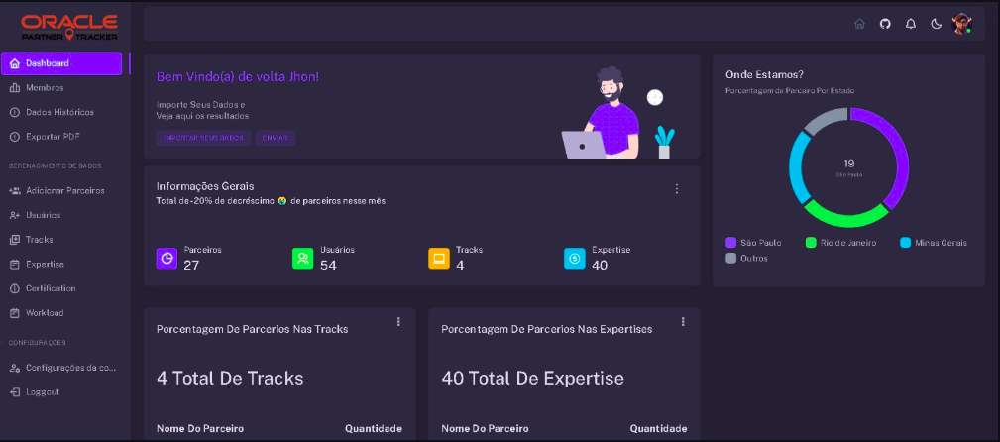
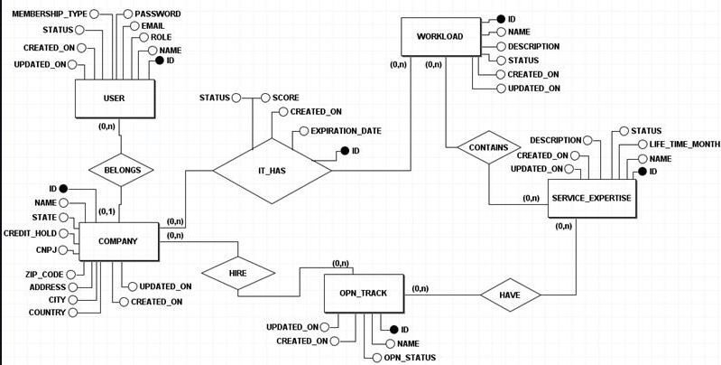

# Lucas Augusto Oliveira de Souza

## Introdução
Meu nome é Lucas, no momento em que estou redigindo este texto sou estudante no curso de banco de dados, formado em Gestão da Produção Industrial pela Fatec e Pós-Graduado em Administração de Empresas, mas sempre tive inclinações para a área de exatas onde me chamava mais atenção. Primeira linguagem que eu estudei foi Javascript pois é bem flexível quanto a suas aplicações, e minha fonte de estudo sempre foi através de cursos pela internet até ingressar na universidade e aprender Python e Java. 

## Redes sociais
* [Github](https://github.com/LucasOliveira321)
* [LinkedIn](https://www.linkedin.com/in/lucas-augusto-oliveira/)

## Meus Principais Conhecimentos
Conhecimentos desenvolvidos na FATEC no 4º semestre foram:
<h4>BACKEND</h4>
* Java  
* Spring Boot  
<h4>FRONTEND</h4>
* Javascript  
* VUE  
* CSS  
<h4>BANCO DE DADOS</h4>
* DML - Data Manipulation Language  
* DDL - Data Definition Language  
* DQL - Data Query Language  
* DTL - Data Transaction Language  
* DCL - Data Control Language  
* PL-SQL  
* MYSQL  
<h4>VERSIONAMENTO DE CÓDIGO</h4>
* GITHUB  
* FLYWAY  

## Portfolio
### 4º Semestre - Oracle Partner Tracker
No primeiro semestre de 2024, a empresa Oracle pediu um programa para controlar as expertise e certificações dos seus parceiros. Assim, teria um acompanhamento das empresas parceiras da Oracle, por meio de graficos para a visualização de dados de forma inteligente, facilitando a identificação de melhorias e de conclusões estratégicas, alem de ter uma visibilidade da performance das empresas parceiras. Para saber mais sobre o projeto visite nosso Repositório no Github.

 Mockup do projeto 

 

### Tecnologias Utilizadas
No 4° Semestre as tecnologias usadas foram: 
<h4>BACKEND</h4>
* Java  
* Spring Boot  
<h4>FRONTEND</h4>
* VUE  
* CSS  
* JavaScript  
<h4>BANCO DE DADOS</h4>
* DML - Data Manipulation Language  
* DDL - Data Definition Language  
* DQL - Data Query Language  
* DCL - Data Control Language  
* PL-SQL  
* MYSQL  
<h4>SEGURANÇA</h4>
* JWT (JSON Web Tokens)  
* Spring Security  
* BCrypt  
<h4>VERSIONAMENTO DE CÓDIGO</h4>
* GITHUB  
* FLYWAY  

#### Contribuições Pessoais
* Java Spring Boot. 
 Durante o quarto semestre da faculdade, desenvolvi com meu grupo uma Aplicação WEB em Java Spring Boot, além da aplicação das ferramentas do Spring Boot que habitualmente já utilizamos nos projetos anteriores como DTO, JPA, Security, JWT e Bcrypt, ajudei na implementação do Flyway e do Opencsv para trabalhar com a adição e exportação de dados para o CSV. 

* Administração do Banco de Dados. 
 Com o aprendizado do quarto semestre apliquei permissões de acordo com o usuário que acessava o banco de dados, realizando assim durante o começo do projeto o papel de Data Base Administrator. 

* PL-SQL. 
 Com a linguagem de programação PL-SQL ajudei a elaborar Triggers para gerenciar eventos de uploads de algumas tabelas e registrar históricos de atualização, isso ajudou na otimização do banco. 

##### Diagrama MER 

### Hard Skills
No quarto semestre do curso, adquiri habilidades com foco na gestão de banco de dados para fazer a gestão e das permissões
de acordo com os usuários que acessavam o banco, assim como administração dos eventos com o PL-SQL onde criamos triggers para 
monitorar eventos com objetivo de atualizar tabelas com o objetivo de registrar o histórico de algumas tabelas, isso sem contar
com os demais desenvolvimentos com o Java Spring Boot para gerar relatórios, estruturando as pastas do projeto de forma eficiente 
separando as responsabilidades, aproveitando as vantagens do ecossistema Spring para criar sistemas escaláveis e de alta qualidade. 
E o frontend em html e css com javascript requisitando a API com requisições usando Javascript puro e administrando o token JWT para
carregar nas requições necessárias para o desenvolvimento de aplicações web interativas e dinâmicas.

### Soft Skills
No quarto semestre do curso, desenvolvi minhas habilidades voltadas para a colaboração com os demais e alinhando o conhecimento
dos demais integrantes com o meu pois mudei de grupo e foi necessário trabalhar a cultura do desenvolvimento em grupo buscando
direcionar as atividades de forma agradavel para todos do grupo mesmo ocupando a função de desenvolvedor. Contribuí na elaboração de 
issues que impulsionaram a evolução das regras de negócio. Nesse processo, ferramentas como GitHub e Jira foram 
essenciais para a organização e gestão das demandas do time.